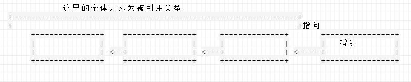

# 3 C的语法

## 3.1 解读C的声明
### 3.1.1 用英语来阅读

```c
int (*pf)()

// pf is pointer to function returning int
// pf 为指向返回int的函数的指针

```
- - - - --
### 3.1.2 解读C的声明
不考虑 const 和 volatile 下，C的声明遵循下面读法

+ 首先着眼于 标识符( 变量名或函数名 )
+ 从标识符最近的地方开始，依照优先顺序解释派生类型( 指针、数组和函数)
    - 用于 整理声明内容的 `括号`
    - 用于表示数组的 `[]`, 用于表示函数的 `()`
    - 用于表示指针的 `*`
+ 解释完派生类型，使用 'of' 、 'to' 、 'returning' 将它们连接起来
    - 指针 ` pointer to `
    - 函数 ` returning `
    - 数组 ` array of `
+ 最后，追加数据类型修饰符( 在左边 ，int、double等 )

```c
int *hoge[10] ;
// hoge is array (with 10 elements) of pointer to int
// hoge是指向int的指针的数组（元素个数10）


int (*func)(int a)
// func is pointer to function (参数为int a) returning int 
// func 是指向 返回int的函数(参数为int a)的指针

```
- - - - -
### 3.1.3 类型名
在C中，除标识符外，有时候还必须定义 ‘类型’。
具体来说，遇到以下情况需要定义‘类型’：

- 在强制转换运算符中
- 类型作为 `sizeof` 运算符的操作数


- - - - --

## 3.2 C的数据类型的 模型

### 3.2.1 基本类型 和派生类型
```c
int (*func_table[10])(int a)
// 指向 返回int 的函数（参数为int a）的指针的数组（元素个数为10）
```
结构链式图：


+ 姑且忽略 结构体、共用体、typeof等类型， 链的最后面的元素是基本类型
+ 此外，从倒数第2个元素开始的元素都是派生类型。
    - 除了结构体、共用体之外，还有3种派生类型
    - 指针
    - 数组 (‘元素个数’作为它的属性)
    - 函数

>除基本的算术类型以外,利用以下的方法可以生成概念上无限种类的派生类型：
>给出类型的对象的数组
> 返回给类型的对象的函数
> 指向给出类型的对象的指针
> 包含各种一系列对象的结构体
> 能够包含各种类型的数个对象中的任意一个共同体

`从基本类型开始，递归地粘附上派生类型，就可以生成无限类型`
- - - - -
### 3.2.2 指针派生类型
指针类型
> 指针类型可由函数类型，对象类型或不完全的类型派生， 派生指针类型的类型称为引用类型。
> 由引用类型T派生的指针类型有时称为'（指向）T的指针'。

链式：



对于指针进行加法运算，指针只前进指针所指向类型的大小的距离。


- - - - --

### 3.2.3 数组派生类型

和指针类型一样，数组类型也是从其它元素的类型派生出来的，
‘元素个数’作为类型的属性添加到类型后面。


- - - - -
### 3.2.4 什么是指向数组的指针

‘数组’ 和 ‘指针’都是派生类型。它们都是由基本类型开始重复派生成的。
也就是，派生出’数组‘之后，再派生出’指针‘，就可以生成’指向数组的指针‘。

在表达式中，数组可以被解读成指针， 即’指向数组初始元素的指针‘。
```c
int    array[3];
int    (*array_p)[3];

array_p = &array;   // 数组添加&，取得’指向数组的指针‘
array_p = array;     // 这样赋值就会出现编译报警，’指向int的指针‘ 和 ’指向int的数组的指针‘是不同的类型
```

从地址角度看， array 和 &array 也许就是指向同一地址，但它们在做指针运算时结果是不同的。

- - - - --
### 3.2.5 C语言中不存在多维数组

在C中，可以通过下面的方式声明一个多维数组。
```c
int    array[3][2];
```
上面声明解读为，’int的数组(元素个数2)的数组(元素个数3)‘。
即，’数组的数组‘，而不是int类型的多维数组。

’数组‘就是将一定个数的类型进行排列而得到的类型。


>C 语音中不存在多维数组
> 看上去像多维数组，其实是’数组的数组‘。


对于下面的这个声明：
```c
int    hoge[3][2]
```
可以通过 `hoge[i][j]]` 的方式去访问，此时， `hoge[i]` 是指“int 的数组（元素个数2）的数组（元素个数3）”，
中的第i 个元素，其类型为 “int 的数组（元素个数2）”，即也可以解读为 “指向int的指针”。


int  的数组（元素个数2）的 `数组（元素个数3）`
着重部分在表达式中可以理解为指针。
即： `指向` int 的数组（元素个数2）`的指针`
也就是说 `指向数组的指针`。
下面的定义都是语法糖：
```c
void    func( int hoge[3][2] )

void    func( int hoge[][2] )

// 真实的写法：
void    func( int (*hoge)[2] )
```
- - - - -
### 3.2.6 函数派生类型
函数也是一种派生类型，‘参数（类型）’是它的属性。


有特定长度的类型，即可以通过sizeof运算符取得大小的类型，在标准中称为 对象类型。

函数类型不是对象类型，因为函数没有特定长度。
所以C中不存在'函数类型的变量'。

此外，函数类型不能成为结构体和共同体的成员。

- - - - -
### 3.2.7 计算类型的大小
除了 函数类型和不完全类型（如结构体标记的声明），其他类型都有大小。

+ 基本类型
    - 基本类型必定依赖处理环境进行计算
+ 指针
    - 指针的大小是依赖处理环境决定的。
+ 数组
    - 数组的大小 可以通过派生源类型的大小乘以元素个数得到
+ 函数
    - 函数的大小无法计算

- - - - -
### 3.2.8 基本类型
派生类型的底层是基本类型。
`基本类型`指， char 和 int 的整型以及 float 和 duoble的浮点类型。

这些类型加上 枚举类型，统称`算术型`。

基本类型的不同写法：
```table
推荐 (-) | 同义的表现 (-)
char | 
signed char | 
unsigned char | 
short | signed short , short int, signed short int
unsigned short | unsigned short int
int | signed, signed int , 无指定类型
unsigned int | unsigned
long | signed long, long int, signed long int
unsigned long | unsigned long int
float |
double | 
long double |
```
char 和 signed char 或者 unsigned char 同义。
 至于默认情况下，char 究竟是有符号或无符号，取决于处理环境。

C 规范中规定了每种类型可以表示的值的范围。

+ 有符号 char:  \-127 ~ \+127    (1个字节)
+ 无符号 char:  0 ~ 255
+ 有符号 int, 有符号 short： \-32767 ~ \+32767
+ 无符号 int, unsigned short ： 0 ~ 65535
+ 有符号 long:  \-2147483647 ~ \+2147483647
+ 无符号 long: 0 ~ 4294967295


- - - - -
### 3.2.10  不完全类型
C的类型分为：
    对象类型（char、int、数组、指针、结构体等）
    函数类型
    不完全类型

不完全类型指“函数之外、类型大小不能被确定的类型”。

在C标准中，void类型也被归类为不完全类型。


- - - - --
### 3.3 表达式
`基本表达式` 是指：

+ 标识符 （变量名、函数名等）
+ 常量 （包括整数常量 和 浮点常量）
+ 字符串常量 （使用 ""括起来的字符串）
+ 使用() 括起来的表达式

对于下面表达式:
```c
 a + b * 3 / ( 4 + c )
```
可以使用下面树结构表现：


此外，`所有的表达式都持有 类型`。


> 针对‘表达式’使用 sizeof
> sizeof (类型名) 或 sizeof 表达式
> sizeof 运算符只是向编译器问询大小的信息，
> 它只能在编译器明确知道对象大小的情况下使用。
>

- - - - --
### 3.6 数组和指针是不同的事物

> C语言中的数组和指针是完全不同的。


